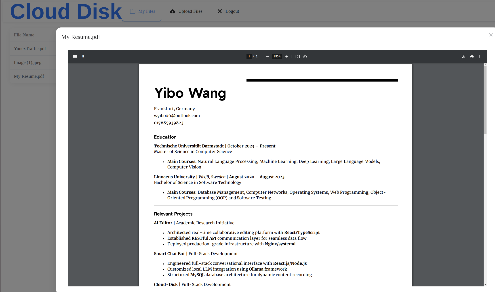

# Cloud Storage Project

A full-stack cloud storage application with secure file management capabilities.

## Features

- User Authentication (Register/Login)
- File Upload/Download
- File Management (List/Delete)
- Secure Storage with User Isolation

## Functionality appearance



## Technology Stack

### Backend
- Spring Boot
- Spring Security
- MySQL Database
- MyBatis
- Java 17

### Frontend
- Vue.js
- Axios
- Element UI

## Getting Started

### Prerequisites
- Java 17 or higher
- MySQL 8.0 or higher
- Node.js 14 or higher
- Maven 3.6 or higher

### Database Setup
1. Create a MySQL database named `cloud`
2. Update database configuration in `springboot/src/main/resources/application.yml`

### Backend Setup
```bash
cd springboot
mvn clean install
mvn spring-boot:run
```

### Frontend Setup
```bash
cd frontend
npm install
npm run dev
```

## API Endpoints

### Authentication
- POST `/register` - Register new user
- POST `/login` - User login

### File Operations
- POST `/files/upload` - Upload file
- GET `/files/list` - Get user's files
- GET `/files/download/{fileId}` - Download file
- DELETE `/files/delete/{fileId}` - Delete file

## Security

- JWT-based authentication
- File access control per user
- Password encryption
- CORS configuration

## Configuration

Key configuration files:
- `application.yml` - Backend configuration
- `SecurityConfig.java` - Security settings
- `.env` - Frontend environment variables

## Project Structure

```
cloud-project/
├── frontend/         # Vue.js frontend
├── springboot/       # Spring Boot backend
│   ├── src/main/
│   │   ├── java/
│   │   └── resources/
│   └── pom.xml
└── README.md
```

## Contributing

1. Fork the repository
2. Create a feature branch
3. Commit changes
4. Push to the branch
5. Create a Pull Request

## License

This project is licensed under the MIT License.